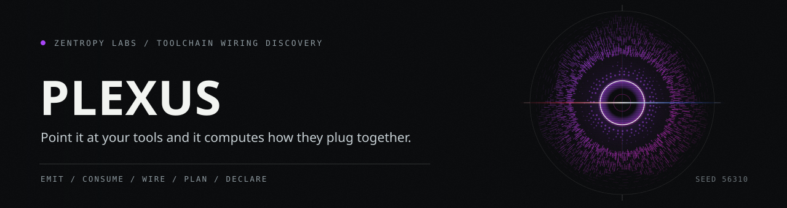

<p align="center"></p>

# plexus

**Capability discovery and auto-wiring for agent toolchains.** Point it at a set
of tools and it discovers what each one emits and consumes, then wires producer
to consumer into a runnable pipeline. Zero runtime dependencies.

MCP tells an agent *that tools exist*. plexus tells it *how their outputs plug
into each other's inputs*: the layer above a flat tool list.

```
pip install git+https://github.com/HarperZ9/plexus.git
```

```
$ plexus discover --builtin
$ plexus plan --goal crucible
$ plexus route --from gather --to crucible
$ plexus graph --format mermaid       # a diagram of the whole mesh
$ plexus run --goal crucible          # a runnable pipeline script
$ plexus mcp                          # stdio MCP server for agents to query live
```

An agent (Claude Code or any MCP client) can point at `plexus mcp` and call
`plexus_discover` / `plexus_plan` / `plexus_route` while it works, so the mesh is
consumable mid-task, not just from a human's terminal.

How it compares to MCP / LangGraph / Dagster / CrewAI: see [COMPARISON.md](COMPARISON.md).
plexus is the discovery layer that sits *above* an executor, not another executor.

<p align="center"></p>

## The problem

You wire up five tools. Each one produces artifacts and accepts inputs, but
nothing knows how they connect, so you hand-wire `A | B | C` every time and
rediscover the plumbing on every new task. plexus makes the toolchain
self-describing: each tool ships a small manifest of what it emits and consumes,
and plexus computes the wiring graph: which tool's output is which tool's input.

## What you get

**Discover the mesh.** Every producer→consumer edge, by capability:

```
$ plexus wiring --builtin
{
  "crucible.replay-pack/1":           [["mneme", "crucible"]],
  "crucible.replay-template/1":       [["crucible", "mneme"]],
  "crucible.thesis/1":                [["mneme", "crucible"]],
  "gather.digest/1":                  [["gather", "crucible"]],
  "gather.items/1":                   [["gather", "mneme"]],
  "index.verification/1":             [["index", "crucible"]],
  "project-telos.flagship-action/v1": [["crucible","index"],["forum","index"],["gather","index"]]
}
```

The Mneme/Crucible replay loop is bidirectional and schema-exact: Crucible emits
`crucible.replay-template/1` for Mneme to consume, and Mneme emits
`crucible.replay-pack/1` for Crucible to consume. The existing
`crucible.thesis/1` Mneme→Crucible route remains a separate declared edge.

**Plan a pipeline.** "I want to feed `crucible`. What produces its inputs?"

```
$ plexus plan --goal crucible
  order:   forum -> gather -> crucible -> index -> mneme
  sources: forum, gather
  cyclic:  crucible, index, mneme  # both feedback loops, reported not hidden
```

**Route between two tools.** "I have `gather` output and want a `crucible`
verdict. How do they connect?"

```
$ plexus route --from gather --to crucible
  [gather -> crucible via gather.digest/1]
```

**A plan you can re-verify.** Every `plan` and `route` carries a receipt that binds the
wiring to the exact manifests it came from: the content hash of every organ, plus a hash
over the derived plan. Save a plan, and later re-check it against the live mesh:

```
$ plexus plan --goal crucible --builtin > plan.json
$ plexus verify --plan plan.json --builtin     # exit 0 if it still holds, 1 if it drifted
```

`verify` re-derives the plan from the manifests (it never trusts the saved body), so a
tampered plan is caught, and a tool whose manifest changed since the plan makes the wiring
drift **visible** instead of letting it silently shift under you. Exit non-zero on drift,
so it works as a CI check over your toolchain's wiring.

Two things make that check worth running. `verify` rebuilds the receipt from the
plan it just re-derived, not from the one saved in the file, so editing the saved
body cannot make it agree with itself. And the receipt carries a method version
that has to match before anything else is compared, so a plan written by an older
plexus is reported as failing rather than silently re-interpreted under new rules.

## How a tool plugs in

A manifest is plain JSON. A tool ships one and it joins the mesh. Drop
`*.interop.json` files in a directory and `plexus discover --dir DIR` reads them:

```json
{
  "organ": "mytool",
  "invoke": {"cli": "mytool", "mcp_server": "mytool.mcp:serve", "python_import": "mytool"},
  "emits": [
    {"capability": "mytool.report/1", "title": "analysis report",
     "module": "src/mytool/report.py:build", "consumable_as": ["crucible.thesis/1"]}
  ],
  "consumes": [
    {"capability": "gather.digest/1", "title": "evidence intake",
     "module": "src/mytool/intake.py:load"}
  ]
}
```

An edge `A -> B` forms when `B` consumes a capability that `A` emits (directly,
or via `consumable_as`, the way a producer declares "my output is also
consumable as X"). Matching is by capability string, so an edge exists wherever
the tools DECLARE compatible capabilities. plexus does not run the tools, so the
edge is a declared claim, not a probed result.

The five flagship manifests are committed under [`manifests/`](manifests/) and
were generated by `plexus export`: the exact files each tool ships. Discovery
from those JSON files produces the same mesh as the built-in registry (a
round-trip test enforces it), so the format faithfully represents a real tool.

### Extended manifests (August 2026)

The registry now covers **eight organs** (not five): the original flagships
(gather, crucible, forum, index, mneme) plus three new manifests:

- **learn**: tutor credential/mastery ledger entries, proof lessons,
  misconceptions. Consumes crucible theses for proof-lesson derivation.
- **telos**: room summary, golden workflow verification, workbench status.
  Consumes flagship-action envelopes for cross-tool reconciliation.
- **flywheel-infra**: 10 capabilities from the Flywheel infrastructure
  controls (egress, lesson, tool-call-receipt, TADR classification,
  governance envelope, credential scan, correlated event, isolation test,
  kill switch, run BOM). Consumes accountable-surface actuation outcomes,
  mneme drift reports, and learn misconceptions for lesson derivation.

### Probe mode

`probe_lane(name)` actually spawns a lane's MCP server and calls
`tools/list` + `status`, returning `{reachable, tools, error}`. Unlike the
declared manifest (which cites source files without running them), the probe
verifies the lane is live. `probe_all()` probes every registered lane.

```python
from plexus.registry import probe_all
results = probe_all(timeout=10)
for r in results:
    print(f"{r['name']:20} reachable={r['reachable']} tools={len(r['tools'])}")
```

## Declared, not probed

<p align="center"></p>

Every edge is tagged `evidence: "declared"` and cites the **module** its producer
names as the source (`file:function`). plexus does not import, resolve, or run
that pointer, so the citation is a self-reported claim to check, not a verified
receipt. The built-in manifests for the five flagships (gather, crucible, forum,
index, mneme) were transcribed by hand from a one-time source survey (2026-07-07);
the running tool re-checks none of it, so treat every edge as declared until you
follow the pointer yourself.

plexus is also honest about what does **not** connect:

- `orphans().unmet_inputs`: capabilities something consumes that nothing in the
  set emits (an external or human input).
- `orphans().unconsumed_outputs`: artifacts nobody downstream consumes (terminal
  outputs).
- `plan(...).cyclic`: feedback loops, surfaced instead of forced into a false
  linear order.
- `discover().collisions`: organ ids declared by more than one manifest, named
  rather than silently resolved last-writer-wins.

<p align="center"></p>

An unmet input is a capability something consumes that nothing in the set emits,
and an unconsumed output is the mirror of it. Both fall out of the same
comparison, so neither is a special case someone remembered to write. The set is
also exactly what you handed it: plexus reads the manifests present and reasons
about nothing else, which is why an unmet input means only that no manifest here
produces it, not that no such tool exists.

## Receipt

`plexus discover` stamps a `receipt` on its output: the plexus version, a UTC
timestamp, and for every manifest read its `source` (`builtin:registry` or the
file path) plus a `sha256` over the manifest's canonical content. The hash binds
what was declared, so a stranger can recompute it from the same bytes and pin the
mesh to exactly the manifests that produced it.

## Install

```
pip install git+https://github.com/HarperZ9/plexus.git
```

## Library

```python
from plexus import (builtin_manifests, discover, plan_to, route,
                    to_mermaid, pipeline_script)

mesh = discover(builtin_manifests())
mesh.edges                      # every producer -> consumer edge, each tagged declared
mesh.wiring()                   # capability -> [(producer, consumer)]
mesh.orphans()                  # unmet inputs / unconsumed outputs
plan_to(mesh, "crucible")       # the upstream pipeline (+ any cycles)
route(mesh, "gather", "crucible")   # the capability path between two tools
to_mermaid(mesh)                # a Mermaid diagram of the mesh
pipeline_script(mesh, "crucible")   # a runnable shell pipeline
```

## License

Plexus is fair-source: open to read, run, and build on, with commercial use reserved so the project can fund its own development. See [LICENSE](LICENSE).

## What this believes

This tool is one part of a family that holds a single belief steady across
every surface: knowledge open to anyone who can attain the means; acceptance
decided by external checks, never reputation; every result re-runnable;
honest nulls first-class; ownership earned by comprehension; learning woven
into the work. The full text lives in [CREDO.md](CREDO.md).
The long form of this belief: [The Unbundling](https://github.com/HarperZ9/flywheel/blob/fix/release-model-identity/docs/essays/2026-07-13-the-unbundling.md).

---

**[Zentropy Labs](https://github.com/ZentropyLabs-ai)** · order out of entropy. An independent lab building evidence-first tools that leave a re-checkable artifact behind. Built by Zain Dana Harper in Seattle. The full workbench is at [Project Telos](https://harperz9.github.io).
